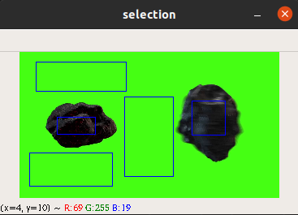
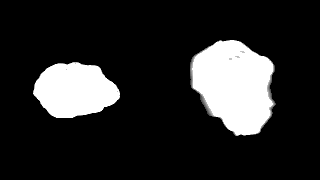
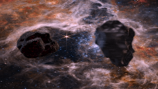

# Chroma Keying with Mishima's Algorithm
ChromaKeying-Mishima: A Python Implementation of Mishima's Cutting-Edge Chroma Keying Algorithm

Welcome to ChromaKeying-Mishima, 
Key Features:
- Cutting-edge chroma keying: Utilize Mishima's state-of-the-art algorithm to effortlessly extract subjects from their backgrounds with precision and speed.
- Versatile compatibility: Seamlessly integrate with your existing image and video processing pipelines, with support for popular formats and libraries.
- Customizable parameters: Fine-tune keying parameters to adapt to varying lighting conditions, background complexities, and subject characteristics.
- Scalable performance: Efficiently process large datasets and real-time streams with optimized algorithms for speed and resource utilization.
- Comprehensive documentation: Dive into detailed documentation and examples to swiftly integrate Mishima's chroma keying into your projects, whether you're a seasoned developer or a newcomer to computer vision.

Join us in unlocking the potential of Mishima's chroma keying algorithm for your image and video processing needs. Let's redefine the possibilities of background removal together.

This repository contains an implementation of Mishima's algorithm for alpha matting.
The algorithm is described in detail at https://patentimages.storage.googleapis.com/90/2e/40/dbf96721e84b8d/US5355174.pdf

## Installation
To install the following repository:

```
pip install -r requirements.txt
```

## Usage
To run the following repository. Run

```
python main.py input.mp4 bg_image.png
```
Once you run this, a region selection window will appear. To proceed with processing
use that window to select definite background and definite foreground regions by following the
following instructions.
<ol>
  <li>Select a region by drawing a rectangle from the frame</li>
  <li>Option 1: Press <code>b</code> to mark the region as definite background</li>
  <li>Option 2: Press <code>f</code> to mark the region as definite foreground</li>
  <li>You go back to step 1 to keep selecting and assigning as many times as you want</li>
  <li>If you have assigned the last selected region press <code>q</code> to go to the next step</li>
</ol>
Initial processing to determine the polyhedrons takes a while;thus, you may have to wait.

### Region Selection and Intermediate/Final Outputs

<br/>

<br/>

<br/>

